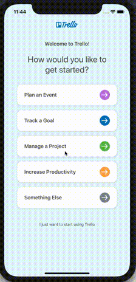

Trello iOS Assisted Onboarding
==============================

This project is a simple iOS App that hosts the Trello iOS Assisted Onboarding screens. The code was written using
an MVVM architecture with RxSwift in a declarative/stateless style.

This code was open-sourced to provide a bigger example of production code that 

1. Uses Reactive Programming in more complex ways.
2. Is extensively unit tested.
3. Takes advantage of iOS accessibility features and works at all dynamic type sizes and supports voice-over and iOS 13 voice control.
4. Adapts to different size-classes.
5. Is localized to 21 languages.

How to build
------------

The project uses carthage to install dependencies and Swift 5 (Xcode 10.2.1)

1. Clone this repo
2. In the root folder, type `carthage update`
3. Open `TrelloAssistedOnboarding.xcodeproj` in Xcode 10.2.1 or later and build/test/run

Usage
-----

This app shows a Trello board with a guidance overlay. If you tap the green button on any overlay, it will give focus to the text field it is describing and once you complete editing, you will be moved to the next step in the process.



Once you learn about something, you are allowed to interact with it any time later in the process.  The assisted onboarding will progress through the board name, list names, and card names -- finally it will let you create the board.  In this sample code, the last green button does nothing (in Trello, it would create the board and take you to it)

Basic Architecture
------------------

The main two classes to look at are `OnboardingViewController` and `OnboardingViewModel`.  Together they implement Model-View-ViewModel using a Reactive style. 

Responsibilities of `OnboardingViewController`

1. Build the view hierarchy
2. Set any constant properties (e.g. colors that don't change)
3. Build the auto-layout constraints
4. Provide RxCocoa Rx extensions to the view model (see `bindUI()`)
5. Connect view model Rx Drivers to view properties
6. Optionally animate any changes

Responsibilities of `OnboardingViewModel`

1. Take an `Input` struct with all of the RxCocoa Rx properties and events that could change something
2. Create an `Output` struct with RxCocoa Drivers for anything in the ViewController that could change

So, for example in the VC, we gather up all the inputs

Here are the RxCocoa properties and events of the board name text field

```
let boardNameTextOrEmpty = boardNameTextField.rx.text.orEmpty.asObservable()
let boardNameEditingDidBegin = boardNameTextField.rx.controlEvent(.editingDidBegin).asObservable()
let boardNameEditingChanged = boardNameTextField.rx.controlEvent(.editingChanged).asObservable()
let boardNameEditingDidEnd = boardNameTextField.rx.controlEvent(.editingDidEnd).asObservable()
let boardNameEditingDidEndOnExit = boardNameTextField.rx.controlEvent(.editingDidEndOnExit).asObservable()
```

And here are the green overlay buttons

```
let boardNameOverlayGoButtonsTap = Observable.merge(self.compactUI.overlays[0].contentView.goButton.rx.tap.asObservable(),
                                                self.regularUI.overlays[0].contentView.goButton.rx.tap.asObservable())
let listNameOverlayGoButtonsTap = Observable.merge(self.compactUI.overlays[1].contentView.goButton.rx.tap.asObservable(),
                                                 self.regularUI.overlays[1].contentView.goButton.rx.tap.asObservable())
let cardTitleOverlayGoButtonsTap = Observable.merge(self.compactUI.overlays[2].contentView.goButton.rx.tap.asObservable(),
                                                self.regularUI.overlays[2].contentView.goButton.rx.tap.asObservable())
```

We even get trait and view size changes (for adapting to the iPad split views)

```
let traitCollection = self.rx.traitCollection.asObservable()
let viewSize = self.rx.viewSize.asObservable()
```

Then, this call into the VM transforms them into Output drivers:

```
let output = viewModel.transform(OnboardingViewModel.Input(
	boardNameText: boardNameTextOrEmpty,
	boardNameEditingDidBegin: boardNameEditingDidBegin,
	boardNameEditingChanged: boardNameEditingChanged,
	boardNameEditingDidEnd: boardNameEditingDidEnd,
	boardNameEditingDidEndOnExit: boardNameEditingDidEndOnExit,
	listViewModels: listViewModels,
	cardViewModels: cardViewModels,
	boardNameOverlayGoButtonsTap: boardNameOverlayGoButtonsTap,
	listNameOverlayGoButtonsTap: listNameOverlayGoButtonsTap,
	cardTitleOverlayGoButtonsTap: cardTitleOverlayGoButtonsTap,
	createBoardOverlayGoButtonsTap: createBoardOverlayGoButtonsTap,
	boardNameOverlaySkipButtonsTap: boardNameOverlaySkipButtonsTap,
	listNameOverlaySkipButtonsTap: listNameOverlaySkipButtonsTap,
	cardTitleOverlaySkipButtonsTap: cardTitleOverlaySkipButtonsTap,
	rightNavForEditingButtonTap: rightNavForEditingButtonTap,
	viewSize: viewSize,
	traitCollection: traitCollection,
	keyboardHeight: RxKeyboard.instance.visibleHeight))
```

The `Input` struct represents anything in the view that could possibly cause a change.  The `Output` struct contains the drivers. We hook them up like this


```
/* Board name */
// Set the text field based on validation from view model
output.boardNameDisplayText.drive(boardNameTextField.rx.text).disposed(by: disposeBag)
// Handle what happens when the Name Board Go Button is tapped
output.focusBoardNameTextField.drive(boardNameTextField.rx.isFirstResponder).disposed(by: disposeBag)
// Handle the board name text field active border
output.boardNameTextFieldShowActiveBorder.drive(boardNameTextField.rx.showBorder).disposed(by: disposeBag)
// Handle the board name text field hint border
output.boardNameTextFieldShowHintBorder.drive(boardNameTextField.rx.showHintBorder).disposed(by: disposeBag)
// Handle the board name text field selecting all text when initially becoming first responder
output.boardNameTextFieldSelectAllText.drive(boardNameTextField.rx.selectAll()).disposed(by: disposeBag)
```

The text, focus, border, and selection are driven by the view model's transformation of the Input observables into Output Drivers.


Here's one example


```
/// Describes whether the board name text field should show the active border
private func boardNameTextFieldShowActiveBorder(_ input: Input) -> Driver<Bool> {
    return Observable.merge(
        input.boardNameEditingDidBegin.map { true },
        input.boardNameEditingDidEnd.map { false },
        input.boardNameEditingDidEndOnExit.map { false }
    ).asDriver(onErrorJustReturn: false)
}
```

This is the thicker border on the board name which shows when you are editing it.  If we ever wanted to change anything about the active border, this is the only function we'd have to change.


And since the ViewModel only takes Observables, it's simple to drive it with subjects in the test.  Here's a test that makes sure the skip buttons slide the next overlay in (they do that by changing a constraint constant)

```
func testSkipButtonMovesOverlay() {
    var leadingConstant: CGFloat!
    output.overlayLeadingConstraintConstant.drive(onNext: { leadingConstant = $0 }).disposed(by: disposeBag)

    let width: CGFloat = 100
    self.viewSize.onNext(CGSize(width: width, height: width * 10))

    XCTAssertEqual(leadingConstant, 0)

    self.boardNameOverlaySkipButtonTap.onNext(())
    XCTAssertEqual(leadingConstant, -width)

    self.listNameOverlaySkipButtonTap.onNext(())
    XCTAssertEqual(leadingConstant, -width * 2)

    self.cardTitleOverlaySkipButtonTap.onNext(())
    XCTAssertEqual(leadingConstant, -width * 3)
}
```

`viewSize` and the skip buttons ares created in `setUp()` 

```
self.viewSize = PublishSubject<CGSize>()
self.boardNameOverlaySkipButtonTap = PublishSubject<Void>()
self.listNameOverlaySkipButtonTap = PublishSubject<Void>()
self.cardTitleOverlaySkipButtonTap = PublishSubject<Void>()
```

We can mock the entire VC by just publishing updates on these subjects -- then check the Output Drivers to make sure they are as expected.
